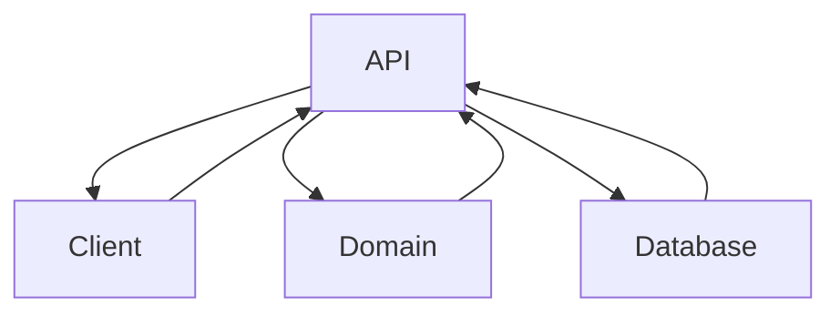

# Software stack

- **MongoDB** (database)
- **React** (web application presentation)
- **Rust** (programming language backend)
- **Actix-Web** (web server)

**External dependencies:**
- **Actix-Web** (to host a Rust web server)
- **Actix-Session** (to persist data in the web server)
- **Rust MongoDB driver** (to connect Rust with MongoDB)
- **Serde** (to (de)serialize Rust datastructures)
- **Rand** (to get random numbers)

# Layers

- Client
- API
- Domain
- Database

# Structure

Each layer has its own directory within /nklootwijk_zoo.